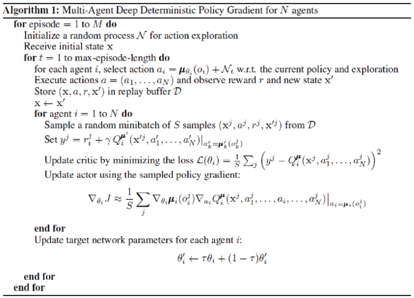

# Report

## The result

The agent was able to solve the environment in 100 episodes. After 16 episodes the mean score over all twenty agents reaches +30 for one episode and followed this line till the end. The mean score over all episodes reaches +30 in episode 46. This gets a valid solution for this project in episode 100. After all 300 episodes the mean score over 100 consecutive episodes has reached a value above 38. In detail: 38.10474414829258. 

## The algorithm

### Overall description

For this project I used the DDPG-Algorithm (Deep Deterministic Policy Gradient). I operate with two four layer feed-forward neural networks. One for the actor and one for the critic. The actor-network consists of 33 input nodes, 400 nodes in the first hidden layer, 300 in the second one and 4 output nodes which represent the four actions the agent can take. The output value of each node in the outputlayer represents the continuous value for the action. The input layer is designed to obtain an input vector with 33 dimensions representing the current state of the environment. The evaluation of the actions takes part in the critic-network. This network has nearly the same architecture as the actor-network, but it has only one output node and receive next to the state of the environment additional the action the agent takes (Apart from this the two architectures are completly the same). Using this information it calculates the Q-value of this state-action-pair. In order to explore the environment i added a noise function following the *Ornstein-Uhlenbeck process*. Also I use a Noise decay to reduce the randomness with time. To prioritize the current reward higher then the expected one of the following time steps I operate with a discount rate of 0.99. To guarantee the repeatability I applied a random seed of 0. The algorithm uses two main optimisations of the Deep-Q-Learning.
The Replay-Buffer and target-networks, one for the critic and one for the actor. To update the target networks a soft update function is used. DDPG is an off-policy algorithm. This means it uses a different policy to update the weights, then it uses to interact with the environment. In my solution there are twenty agents interacting parallel with the environment, all of them collect information which get stored in the replay-buffer. Every 20 timesteps the networks gets updated using 10 samples of the replay-buffer. Because of the usage of two different networks there are also two different ways to update each one of them. On the one hand the actor is updatet much like in the Deep-Q-Learning algorithm I used and explained in the first project of this nanodegree. Herefor the critik-network is used to evaluate the value of the choosen action in this state. On the other Hand the Critic gets updatet using the Q-value the target-critic-network produce. Its important to mention, that only the target networks get slowly ubdated using a soft update function.

### Hyperparameters

Learning Rate (Actor):   0.0001

Learning Rate (Critic):  0.0001

Discount Rate:           0.99

Noise Decay:             0.995

Softupdate Rate:         0.001

Random Seed:             0

### Pseudo-Code

In pseudocode the DDPG-Algorithm looks like following:

