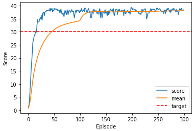

# Report

## The result

The agent was able to solve the environment in 100 episodes. After 16 episodes the mean score over all twenty agents reaches +30 for one episode and follow this line till the end. The mean score over all episodes reaches +30 in episode 46. This gets a valid solution for this project in episode 100. After all 300 episodes the mean score over 100 consecutive episodes has reached a value above 38. In detail: 38.10474414829258. 
